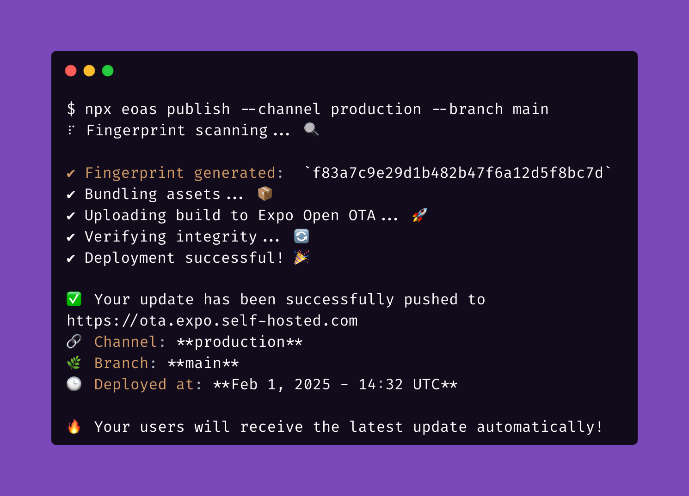

# Expo Open OTA

🚀 **An open-source Go implementation of the Expo Updates protocol, designed for production with support for cloud storage like S3 and CDN integration, delivering fast and reliable OTA updates for React Native apps.**

## ⚠️ Disclaimer

**Expo Open OTA is not officially supported or affiliated with [Expo](https://expo.dev/).**  
This is an independent open-source project.

## 📖 Documentation

The full documentation is available at:  
➡️ [Documentation](https://axelmarciano.github.io/expo-open-ota/)

## 🛠 Features

- **Self-hosted OTA update server** for Expo applications.
- **Cloud storage support**: AWS S3, local storage, and more.
- **CDN integration**: Optimized for CloudFront and other CDN providers.
- **Secure key management**: Supports AWS Secrets Manager and environment-based key storage.
- **Production-ready**: Designed for scalability and performance.

## 📜 License

This project is licensed under the MIT License - see the [LICENSE](./LICENSE.md) file for details.

## 🚀 Need help or want to go faster?

